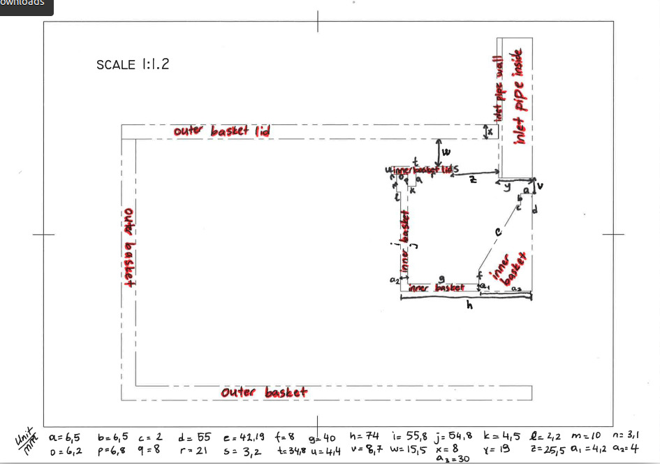

# Parameterized_Centrifugal_Filter
Parameterized GMSH code of a vertical centrifugal filter

## Authors
- MSc. Damla Serper (Aalto Univeristy, Finland) '*corresponding author*'
- Dr. Kevin Hanley (University of Edinburgh, UK)

## What is it?
- Here a vertical, basket-type, laboratory-scale centrfiuge is divided into multiple pieces to be drawn with GMSH in a simplified form.
- This simplified form is used in the research article.

  ### Assumptions
    - The basket has no thickness (it is drawn as a shell)
    - The outer basket is not drawn
    - The inner basket walls are not drawn, instead the filter mesh is drawn as the wall
    - The filter mesh pores are assumed to be repeating square pores (to check how the pore sizes are adjusted please check the research article and check the source code)
    - Inlet pipe height is modified to fit the application
  
  ### Parts
    - Inlet pipe (in_cyl.geo)
    - The filter mesh (dem_walls_30X_14micronpore_mod_mesh.geo, trial.stl that is mentioned in Research Data (https://github.com/DamlaSerper/SCM_Research_Data) is based on this geo file)
    - Top nut that connects the inner basket to the rotating shaft (top_cyl.geo)
    - Conical shape within the centrifuge (cone.geo)
    - The cylindirical part under the cone,the part that is the connection to the bottom of the inner basket (bot_cyl.geo)
    - Top lid of the inner basket (top_disk.geo)
    - The bottom of the inner basket (bottom_disk.geo)
    - Dummy top lid for preventing of particles escaping backwards through the inlet pipe due to the lack of fluids (in_cap.geo)

## How to use it
  - You can modify the s_mult parameter wihtin to get different different size multipliers that will enable you to keep the total pore area same but reduce the amount of pores and increase the size of them.
  - You can modify the p_size parameter to adjust the pore size.
  - You can adjust the top variables to adjust the dimensions of the centrfiuge if you wish so (everything is centered at origin 0,0, refer to picture below).

